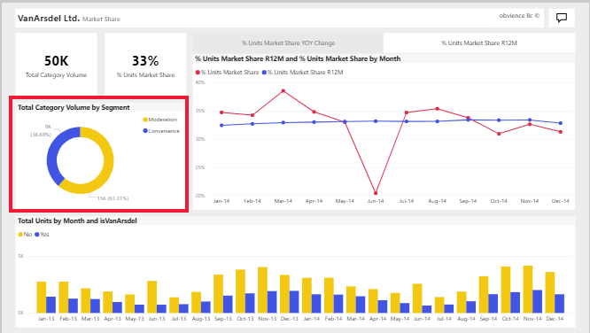
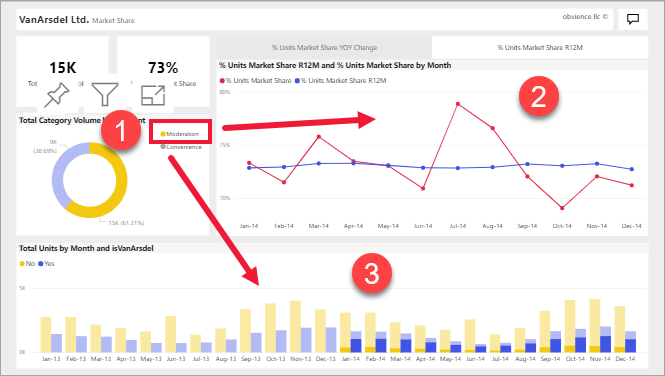
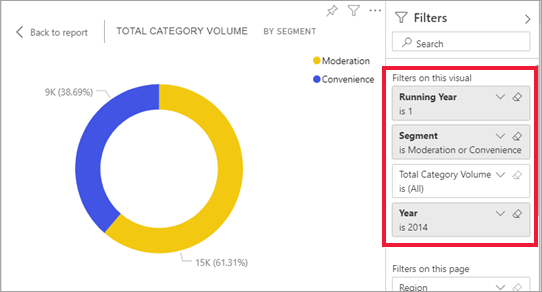

# How visuals cross-filter each other in a Power BI report
One of the great features of Power BI is the way all visuals on a report page are interconnected. If you select a data point on one of the visuals, all the other visuals on the page that contain that data change, based on that selection. 

## How visuals interact with each other

By default, selecting a data point in one visual on a report page will cross-filter or cross-highlight the other visuals on the page. Exactly how the visuals on a page interact is set by the report *designer*. *Designers* have options to turn visual interactions on and off, and to change the default cross-filtering,  cross-highlighting, and [drilling](end-user-drill.md) behavior. 

If you haven't encountered hierarchies or drilling yet, you can learn all about them by reading [drill down in Power BI](end-user-drill.md). 

### Cross-filtering and cross-highlighting

Cross-filtering and cross-highlighting can be useful to identify how one value in your data contributes to another. The terms *cross-filter* and *cross-highlight* are used to distinguish the behavior described here from what happens when you use the **Filters** pane to filter and highlight visuals.  

Let's define these terms as we look at the report pages below. The "Total category volume by segment" doughnut chart has two values: "Moderation" and "Convenience". 

1. Let's see what happens when we select **Moderation**.

    

2. **Cross-filtering** removes data that doesn't apply. Selecting **Moderation** in the doughnut chart cross-filters the line chart. The line chart now only displays data points for the Moderation segment. 

3. **Cross-highlighting** retains all the original data points but dims the portion that does not apply to your selection. Selecting **Moderation** in the doughnut chart cross-highlights the column chart. The column chart dims all the data that applies to the Convenience segment and highlights all the data that applies to the Moderation segment. 

## Considerations and troubleshooting
- If your report has a visual that supports [drilling](end-user-drill.md), by default, drilling one visual has no impact on the other visuals on the report page.     
- Visual-level filters are retained when cross-filtering and cross-highlighting other visuals on the report page. So, If VisualA has visual-level filters applied by the report designer or by you, and you use visualA to interact with visualB, visual-level filters from visualA will be applied to visualB.

    

## Next steps
[How to use report filters](../power-bi-how-to-report-filter.md)    

[About filtering and highlighting](end-user-report-filter.md). 
